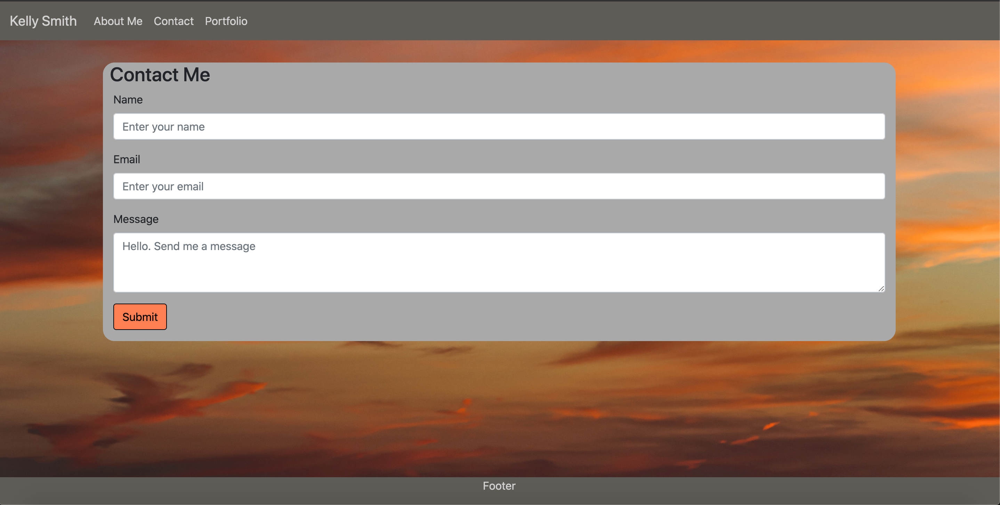

# Responsive Portfolio

*This is my portfolio website. It is created to showcase my work. Initially it will contain an About Me page, a Portfolio page, and a Contact page. Currently the content contains placeholder imgages and texxt but will be update to include actual photos and a paragraph or two about myself*

## Webpage created using:
* HTML - to create the content of the homepage. 
* CSS -  to style the content.
* Bootstrap - to create a navigation bar, containers and grids for content, a footer and a responsive layout

## Features
### Navbar
* contains links to About Me, Portfolio and Contact pages
* uses bootstrap nav bar
* uses custom colors for background and text (in css file)

### Background
* image added to background to replace default

### About Me
* contains a place holder image and lorem ipsum text to be replaced in the near future
* content is reponsive to various screen sizes
* content sits inside a container within a grid
* colors set for background and text (in css file)

### Portfolio
* contains place holder image to be replaced in the near future
* content is reponsive to various screen sizes
* images sit inside a container within a grid
* colors set for background and text (in css file)

### Contact Me
* contains a bootstrap form with input fields for Name, Email and a Message
* content is reponsive to various screen sizes
* additional rows added to Message to make the input field larger
* form contains a button to submit the contact form; button can be pressed but no information is currently sent; will be updated at later date
* colors set for background and text (in css file)

### Footer
* is a sticky footer
* content is reponsive to various screen sizes
* information will be added to footer at a later date
* colors set for background and text (in css file)

## The challenges I met were:
1. The most difficult challenge I had was making the pages responsive to the various screen sizes
    a. this was solved by adding a viewport to each html file and using bootstraps grid sytem with rows and columns
2. Customizing the navbar to use colors other than the default
    a. this was done by using the navbar-custom class in the css and defining the background and text colors
3. Setting a background image to cover the entire background between the navbar and footer
    a. this was done in the css by linking the image and setting the properties such as position and size

## The website is being hosted on github pages.

## Website Images:

